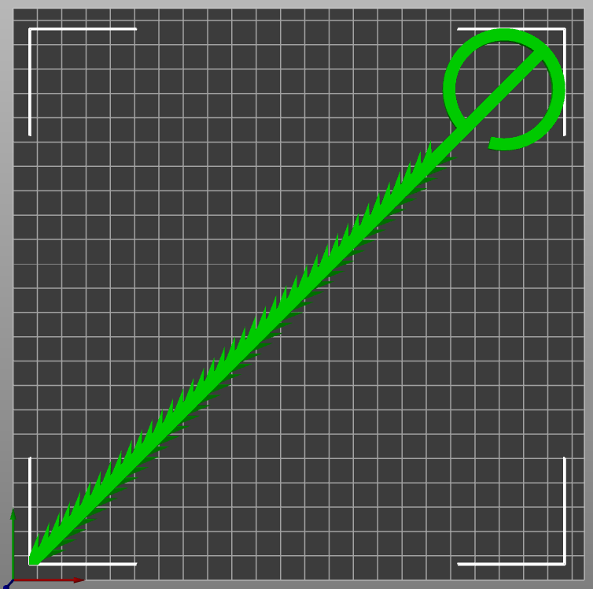
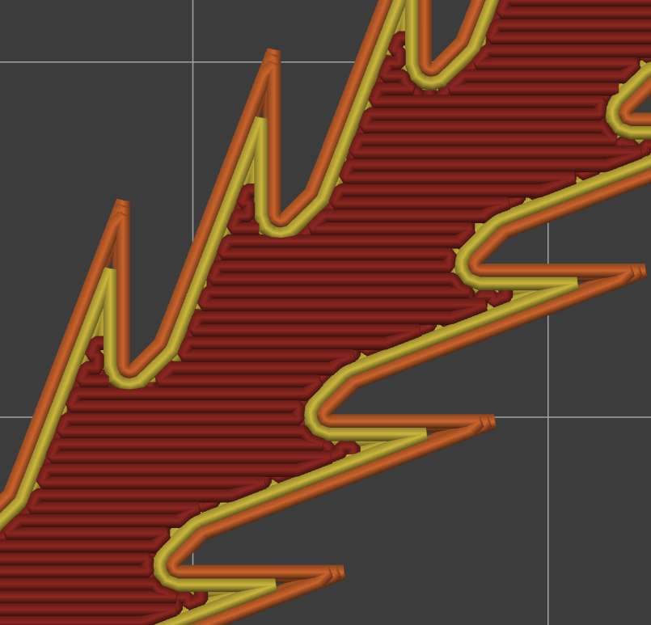
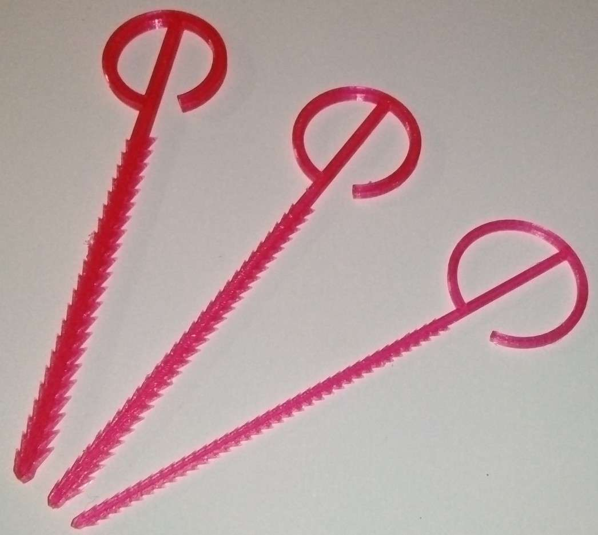
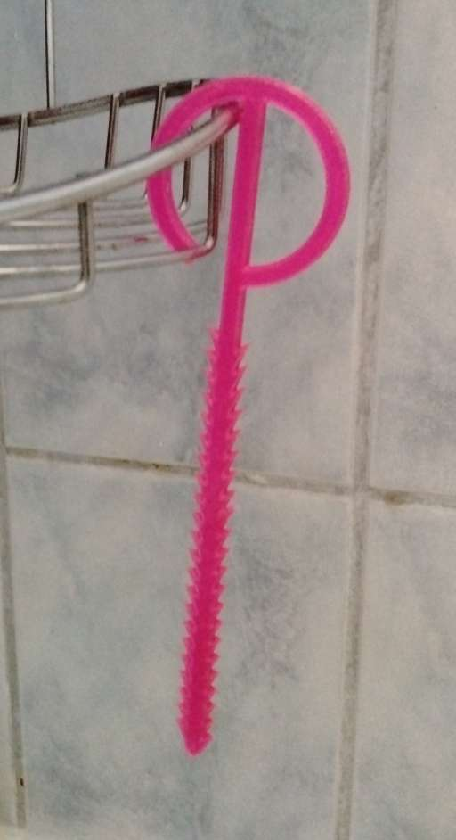
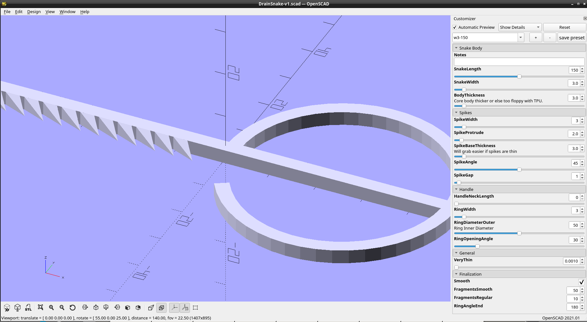
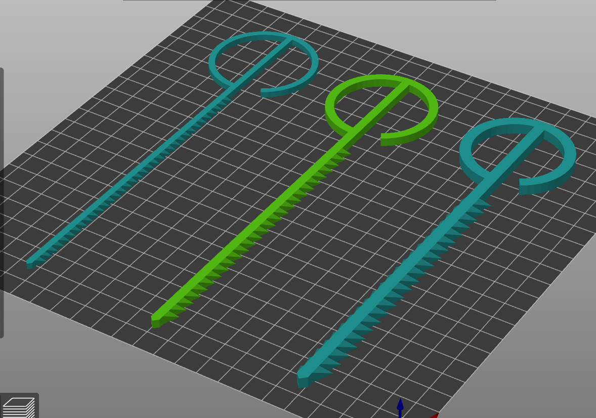

# Drain Snake

## Design Features
- TPU Flexible to make sure it doesn't break down drain
- Many small hooks
- Thicker body to keep it's shape when printing in TPU
- Body much thicker than hooks to ensure that hooks will break before body if ever stuck on a hook down the drain
- Easy to print
- Handle Hook to hang and dry
- Handle Ring to pull

## Dependencies
Depends on the BOSL2 library, of which a cached local version is included.
https://github.com/BelfrySCAD/BOSL2

## Print Notes
- TPU Filament
- Use your standard TPU print settings, or:
- Nozzle: 0.4mm Nozzle
- Layer Height: 0.2mm Height
- First Layer Width: 0.5mm
- Infill: 100%
- Perimeter: 3 Lines

### Longer than build plate width
You can print the drain snakes that are longer than your build plate width by turning them diagonal (45 degrees), See screenshot below. 

 Change your infill angle from 45 degree to 0 degree when printing diagonal, See screenshot below. 

## Images
### Standard Drain Snake sizes in STL folder

### Drain Snake hanging on hook

### OpenSCAD View

### PrusaSlicer View

## Thingiverse Link
https://www.thingiverse.com/thing:6549225